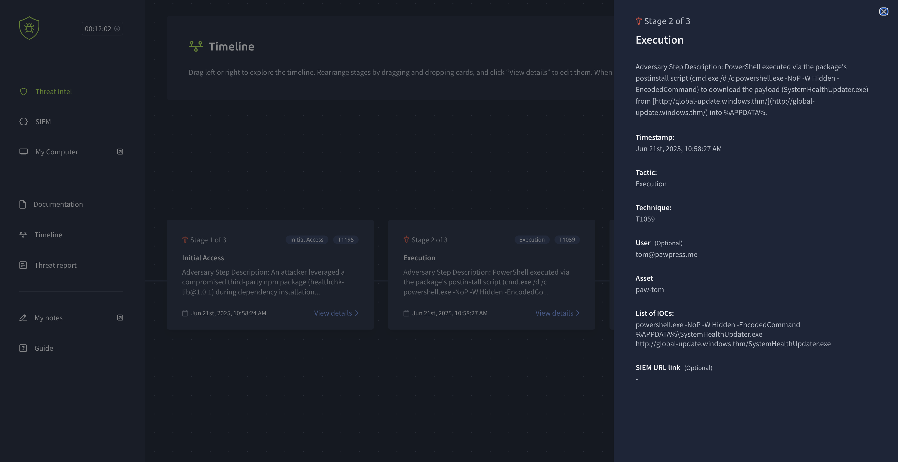
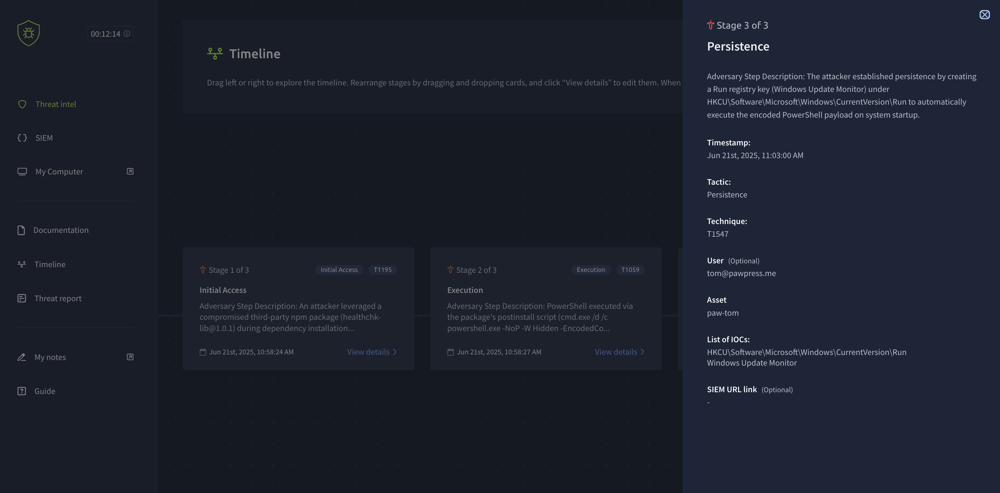

# Threat Hunting Investigation: Operation Health Hazard

## Overview
This repository contains the structured investigation notes, timeline reconstruction, and forensic analysis for **Operation Health Hazard**, a simulated supply chain compromise scenario. The investigation tracks a multi-stage attack involving a trojanized third-party npm package, automated payload deployment via obfuscated PowerShell scripts, and registry-based persistence on a developer endpoint (`paw-tom`).

---

## Incident Summary

* **Target Host:** `paw-tom`
* **Target User:** `tom@pawpress.me`
* **Incident Date:** June 21, 2025
* **Attack Vector:** Software Supply Chain Compromise (Malicious npm Package)
* **Outcome:** Investigation successfully validated and hypothesis proven

---

## Attack Chain Reconstruction

### Stage 1: Initial Access
* **Tactic:** Initial Access (`TA0001`)
* **Technique:** Supply Chain Compromise (`T1195`)
* **Timestamp:** June 21, 2025, 10:58:24 AM
* **Description:** An attacker leveraged a compromised third-party npm package (`healthchk-lib@1.0.1`) during routine dependency installation (`npm install`) to gain initial access to host `paw-tom`.

---

### Stage 2: Execution
* **Tactic:** Execution (`TA0002`)
* **Technique:** Command and Scripting Interpreter (`T1059`)
* **Timestamp:** June 21, 2025, 10:58:27 AM
* **Description:** The package's postinstall lifecycle script executed an obfuscated command string via `cmd.exe` and `powershell.exe`, utilizing hidden windows and encoded commands to download a secondary payload (`SystemHealthUpdater.exe`) into the user's `%APPDATA%` directory.

---

### Stage 3: Persistence
* **Tactic:** Persistence (`TA0003`)
* **Technique:** Boot or Logon Autostart Execution (`T1547`)
* **Timestamp:** June 21, 2025, 11:03:00 AM
* **Description:** The attacker established persistence by creating a Run registry key (`Windows Update Monitor`) configured to automatically execute the encoded PowerShell payload upon system startup and user logon.

---

## Indicators of Compromise (IOCs)

| Indicator Type | Value / Artifact |
| :--- | :--- |
| **Malicious Package** | `healthchk-lib@1.0.1` |
| **Payload Binary** | `%APPDATA%\SystemHealthUpdater.exe` |
| **C2 Download URL** | `http://global-update.windows.thm/SystemHealthUpdater.exe` |
| **Execution Flags** | `powershell.exe -NoP -W Hidden -EncodedCommand` |
| **Persistence Registry Key** | `HKCU\Software\Microsoft\Windows\CurrentVersion\Run\Windows Update Monitor` |

.png)

---

## Scenario Completion & Verification

---

## Remediation & Recommendations
1. **Endpoint Isolation:** Immediately isolate host `paw-tom` from the network to prevent potential lateral movement or data exfiltration.
2. **Artifact Removal:** Delete the malicious binary (`SystemHealthUpdater.exe`) from `%APPDATA%` and remove the unauthorized Run key from the Windows Registry.
3. **Credential Rotation:** Revoke active sessions and rotate credentials for the affected user account (`tom@pawpress.me`).
4. **Perimeter Defense:** Block communication to the adversary infrastructure domain (`global-update.windows.thm`) at the network gateway.
5. **Supply Chain Audit:** Perform a comprehensive audit of all project dependencies and software bill of materials (SBOM) across development environments to ensure no other repositories contain unauthorized third-party packages.
